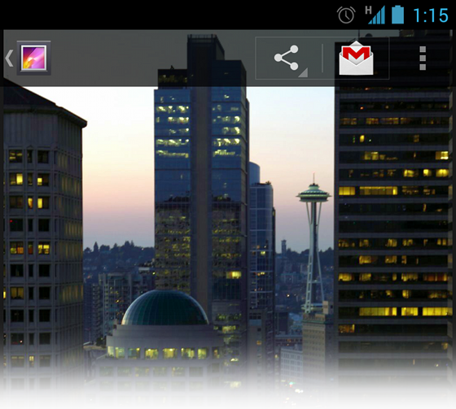

# ActionBar的覆盖叠加

> 编写:[Vincent 4J](http://github.com/vincent4j) - 原文:<http://developer.android.com/training/basics/actionbar/overlaying.html>

默认情况下，action bar 显示在 activity 窗口的顶部，会稍微地减少其他布局的有效空间。如果在用户交互过程中你要隐藏和显示 action bar，可以通过调用 [ActionBar](https://developer.android.com/reference/android/app/ActionBar.html) 中的 <a href="https://developer.android.com/reference/android/app/ActionBar.html#hide()">hide()</a>和<a href="https://developer.android.com/reference/android/app/ActionBar.html#show()">show()</a>来实现。但是，这将会导致 activity 基于新尺寸重新计算与绘制布局。

为了避免在 action bar 隐藏和显示过程中调整布局的大小，可以为 action bar 启用叠加模式(**overlay mode**)。在叠加模式下，所有可用的空间都会被用来布局就像ActionBar不存在一样，并且 action bar 会叠加在你的布局之上。这样布局顶部就会有点被遮挡，但当 action bar 隐藏或显示时，系统不再需要调整布局而是无缝过渡。

> **Note**：如果你希望 action bar 下面的布局部分可见，可以创建一个背景部分透明的自定义式样的 action bar，如图 1 所示。如何定义 action bar 的背景，请查看 [自定义ActionBar的风格](styling.html)。



图 1. 叠加模式下的 gallery action bar

## 启用叠加模式(Overlay Mode)

要为 action bar 启用叠加模式，需要自定义一个主题，该主题继承于已经存在的 action bar 主题，并设置 `android:windowActionBarOverlay` 属性的值为 `true`。

### 仅支持 Android 3.0 和以上

如果 [minSdkVersion](https://developer.android.com/guide/topics/manifest/uses-sdk-element.html#min) 为 `11` 或更高，自定义主题必须继承 [Theme.Holo](https://developer.android.com/reference/android/R.style.html#Theme_Holo) 主题（或者它的子主题）。例如：

```xml
<resources>
    <!-- 为程序或者活动应用的主题样式 -->
    <style name="CustomActionBarTheme"
           parent="@android:style/Theme.Holo">
        <item name="android:windowActionBarOverlay">true</item>
    </style>
</resources>
```

###  支持 Android 2.1 和更高

如果为了兼容运行在 Android 3.0 以下版本的设备而使用了 Support 库，自定义主题必须继承 [Theme.AppCompat](https://developer.android.com/reference/android/support/v7/appcompat/R.style.html#Theme_AppCompat) 主题（或者它的子主题）。例如：

```xml
<resources>
    <!-- 为程序或者活动应用的主题样式 -->
    <style name="CustomActionBarTheme"
           parent="@android:style/Theme.AppCompat">
        <item name="android:windowActionBarOverlay">true</item>

        <!-- 兼容支持库 -->
        <item name="windowActionBarOverlay">true</item>
    </style>
</resources>
```

请注意，这主题包含两种不同的 `windowActionBarOverlay` 式样定义：一个带 `android:` 前缀，另一个不带。带前缀的适用于包含该式样的 Android 系统版本，不带前缀的适用于通过从 Support 库中读取式样的旧版本。

## 指定布局的顶部边距

当 action bar 启用叠加模式时，它可能会遮挡住本应保持可见状态的布局。为了确保这些布局始终位于 action bar 下部，可以使用 [actionBarSize](https://developer.android.com/reference/android/R.attr.html#actionBarSize) 属性来指定顶部margin或padding的高度来到达。例如：

```xml
<RelativeLayout xmlns:android="http://schemas.android.com/apk/res/android"
    android:layout_width="match_parent"
    android:layout_height="match_parent"
    android:paddingTop="?android:attr/actionBarSize">
    ...
</RelativeLayout>
```

如果在 action bar 中使用 Support 库，需要移除 `android:` 前缀。例如：

```xml
<!-- 兼容支持库 -->
<RelativeLayout xmlns:android="http://schemas.android.com/apk/res/android"
    android:layout_width="match_parent"
    android:layout_height="match_parent"
    android:paddingTop="?attr/actionBarSize">
    ...
</RelativeLayout>
```

在这种情况下，不带前缀的 `?attr/actionBarSize` 适用于包括Android 3.0 和更高的所有版本。

