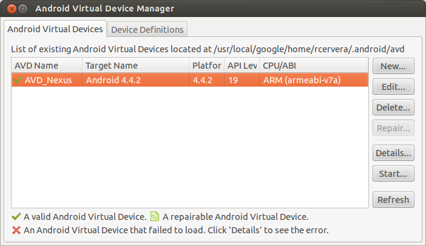

# 执行Android程序

> 编写: [yuanfentiank789](https://github.com/yuanfentiank789) - 原文: <http://developer.android.com/training/basics/firstapp/running-app.html>

通过[上一节课](creating-project.html)创建了一个Android项目，项目默认包含一系列源文件，它让您可以立即运行的应用程序。

如何运行Android应用取决于两件事情：你是否有一个Android设备和你是否正在使用Eclipse开发程序。本节课将会教使用Eclipse和命令行两种方式在真实的android设备或者android模拟器上安装并且运行你的应用。

在运行应用之前，你得认识项目里的几个文件和目录：

**AndroidManifest.xml**

[manifest file](http://developer.android.com/guide/topics/manifest/manifest-intro.html) 描述了应用程序的基本特性并且定义了每一个组件。当你学了更多课程，你将会理解这里的各种声明。
其中一个很重要的点是：你的manifest应该包括[<uses-sdk>](http://developer.android.com/guide/topics/manifest/uses-sdk-element.html) 标签。它会利用 [android:minSdkVersion](http://developer.android.com/guide/topics/manifest/uses-sdk-element.html#min)和 [android:targetSdkVersion](http://developer.android.com/guide/topics/manifest/uses-sdk-element.html#target) 两个属性来声明你应用程序对于不同的android版本的兼容性。在你的第一个应用里，它看起来应该是这样：

```xml
<manifest xmlns:android="http://schemas.android.com/apk/res/android" ... >
<uses-sdk android:minSdkVersion="8" android:targetSdkVersion="19" />
...
</manifest>
```

你应该总是把 [android:targetSdkVersion](http://developer.android.com/guide/topics/manifest/uses-sdk-element.html#target) 设置的尽可能的高并且在对应版本的Android系统上测试你的应用。详见 [适配不同的系统版本](/basics/supporting-devices/platforms.html)

**src/**

这是存放应用的主要源代码的文件夹，默认情况下，里面会包括一个[Activity](http://developer.android.com/reference/android/app/Activity.html)的类，这个类会在点击应用程序图标启动的时候运行。

**res/**

包含一些存放资源文件的目录，例如：

```xml
drawable-hdpi/
```

存放适用于HDPI屏幕的图片素材。同理其他类似文件夹存放适用于其他屏幕的图片素材。

```xml
layout/
```

存放定义用户界面的的文件。

```xml
values/
```

存放其他各种XML文件，也是所有资源的集合，例如字符串和颜色的定义。

当完成该项目的编译和运行工作后，默认的[Activity](http://developer.android.com/reference/android/app/Activity.html)类启动并加载一个布局文件，界面显示 "Hello World."这本身没有什么值得兴奋的，重要的是你学会了如何运行一个Android应用在你开始进行开发之前。

## 在真实设备上运行

如果你有一个真实的Android设备，以下的步骤可以使你在你的设备上安装和运行你的应用程序：

* 把你的设备用USB线连接到计算机上。如果你是在windows系统上进行开发的，你可能还需要安装你设备对应的USB驱动，详见[OEM USB Drivers](http://developer.android.com/tools/extras/oem-usb.html) 文档。
* 开启设备上的USB调试选项。
  * 在大部分运行Andriod3.2或更老版本系统的设备上，这个选项位于“**设置**>**应用程序**>**开发选项**”里。
  * 在Andriod 4.0或更新版本中，这个选项在“**设置**>**开发人员选项**”里。

   > **注意:** 从Android4.2开始，开发人员选项在默认情况下是隐藏的，想让它可见，可以去“设置>关于手机（或者关于设备）”点击“版本号”七次。再返回就能找到开发人员选项了。

用Eclipse在设备里运行程序：

* 打开项目文件，点击工具栏里的**Run**按钮。


* 在 Run as 弹出窗口中，选择 Android Application 然后点击 OK。

Eclipse 会把应用程序安装到你的设备中并启动应用程序。


或者也可以利用命令行安装运行你的应用程序。

* 命令行切换当前目录到Andriod项目的根目录，执行：

```java
ant debug
```

* 确保 Android SDK里的 platform-tools/ 路径已经添加到环境变量的Path中，执行：

```java
adb install bin/MyFirstApp-debug.apk
```

* 在你的Android设备中找到 MyFirstActivity，点击打开。

以上就是创建并在设备上运行一个应用的全部过程！想要开始开发，点击[next lesson](http://developer.android.com/training/basics/firstapp/building-ui.html)。

## 在模拟器上运行

无论你是用 Eclipse 还是命令行，在模拟器中运行程序首先要创建一个 Android Virtual Device (AVD)。AVD 是对 Android 模拟器的配置，可以让你模拟不同的设备。



创建一个 AVD:
* 启动 Android Virtual Device Manager（AVD Manager）的两种方式：
  * 用Eclipse, 点击工具栏里面Android Virtual Device Manager Android。
  * 在命令行窗口中，把当前目录切换到`<sdk>/tools/` 后执行：


```java
android avd
```

* 在 Android Virtual Device Manager 面板中，点击**New**.
* 填写AVD的详细信息，包括名字，平台版本，SD卡大小以及屏幕大小（默认是HVGA）。
* 点击 Create AVD.
* 在Android Virtual Device Manager 选中创建的新AVD，点击 Start。
* 在模拟器启动完毕后，解锁模拟器的屏幕。

接下来就可以像前边讲过的一样用Eclipse或命令行来往模拟器发布运行你的应用程序了。
