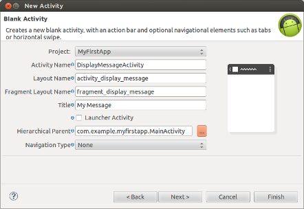
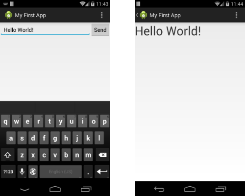

# 启动其他的Activity

> 编写:[yuanfentiank789](https://github.com/yuanfentiank789) - 原文:<http://developer.android.com/training/basics/firstapp/starting-activity.html>

在完成上一课(建立简单的用户界面)后，你已经拥有了显示一个activity（唯一屏幕）的app（应用），并且这个activity包含了一个文本字段和一个按钮。
在这节课中，你将会添加一些新的代码到`MainActivity`中，当用户点击发送(Send)按钮时启动一个新的activity。

## 响应Send(发送)按钮

响应按钮的on-click(点击)事件，打开`fragment_main.xml`布局文件然后在[Button](http://developer.android.com/reference/android/widget/Button.html)(按钮)元素中添加[android:onclick](http://developer.android.com/reference/android/view/View.html#attr_android:onClick)属性:

```xml
<Button
    android:layout_width="wrap_content"
    android:layout_height="wrap_content"
    android:text="@string/button_send"
    android:onClick="sendMessage" />
```

`android:onclick`属性的值`"sendMessage"`就是当用户点击你屏幕按钮时触发方法的名字。

添加相应的方法在`MainActivity`类中：

```java
/** 当用户点击按钮时会被调用 */
public void sendMessage(View view) {
    // 响应按钮的事件处理逻辑
}
```

请注意，为了让系统能够将这个方法（你刚在MyFirstActivity中添加的sendMessage方法）与在`android:onClick`属性中提供的方法名字匹配，它们的名字必须一致，特别是，这个方法必须满足以下条件：

* 公共的
* 返回值类型为空(void)
* 有唯一的视图（View）参数（这个视图就是将被点击的视图）

接下来，你可以在这个方法中编写读取文本内容的代码，并将该内容传到另一个Activity。

## 构建一个Intent

[Intent](http://developer.android.com/reference/android/content/Intent.html)是在不同组件中提供运行时连接的对象(比如两个Activity)。`Intent`代表一个应用"想去做什么事"，你可以用它做各种各样的任务，不过大部分的时候他们被用来启动另一个Activity。

在`sendMessage()`方法中创建一个`Intent`并启动名为`DisplayMessageActivity`的Activity：

```java
Intent intent = new Intent(this, DisplayMessageActivity.class);
```

在这之前你需要导入Intent类:

```java
import android.content.Intent;
```

> **Tip:**在Eclipse中，按Ctrl + Shift + O 可以导入缺失的类(在Mac中使用Cmd + Shift + O )

在这个Intent构造函数中有两个参数：
* 第一个参数是[Context](http://developer.android.com/reference/android/content/Context.html)(之所以用`this`是因为当前[Activity](http://developer.android.com/reference/android/app/Activity.html)(MyFirstActivity)是`Context`的子类)

* 系统需要传递`Intent`的应用组件的[class](http://developer.android.com/reference/java/lang/Class.html)对象（在这个案例中，为应该被启动的activity）。

> **Note**：如果你正在使用的是类似Eclipse的IDE，这里对`DisplayMessageActivity`的引用会报错，因为这个类还不存在；暂时先忽略这个错误，你很快就要去创建这个类了。

一个Intent(意图)不仅允许你启动另一个Activity，同时也可以传递一个数据包到另一个Activity，在`sendMessage()`方法里用<a href="http://developer.android.com/reference/android/app/Activity.html#findViewById(int)">findViewById()</a>方法得到[EditText](http://developer.android.com/reference/android/widget/EditText.html)元素，然后将它的文本信息添加到Intent(意图):

```java
Intent intent = new Intent(this, DisplayMessageActivity.class);
EditText editText = (EditText) findViewById(R.id.edit_message);
String message = editText.getText().toString();
intent.putExtra(EXTRA_MESSAGE, message);
```

> **Note:**你需要导入`android.widget.EditText`类，再定义`EXTRA_MESSAGE`的值。

`Intent`可以携带各种数据类型的集合的key-value附加对，称作extras。 <a href="http://developer.android.com/reference/android/content/Intent.html#putExtra(java.lang.String, android.os.Bundle)">putExtra()</a>方法把键名作为第一个参数，把值作为第二个参数。

为了让下一个activity能够查询额外数据(extra data)，应该用公共常量为`Intent`定义键。所以把`EXTRA_MESSAGE`定义添加到`MainActivity`类：

```java
public class MainActivity extends ActionBarActivity {
    public final static String EXTRA_MESSAGE = "com.example.myfirstapp.MESSAGE";
    ...
}
```

通常使用应用程序包名作为前缀来定义意图键是很好的做法。在应用程序与其他应用程序进行交互时仍可以确保意图键唯一。

## 启动第二个Activity

启动一个Activity，你只需要调用<a href="http://developer.android.com/reference/android/app/Activity.html#startActivity(android.content.Intent)">startActivity()</a>方法然后传入你的`Intent`(意图)，系统接收到你的请求后会实例化在`Intent`中指定的`Activity`。

包含新的代码，被Send(发送)按钮调用的完整`sendMessage()`方法现在就像这样：

```java
/** Called when the user clicks the Send button */
public void sendMessage(View view) {
    Intent intent = new Intent(this, DisplayMessageActivity.class);
    EditText editText = (EditText) findViewById(R.id.edit_message);
    String message = editText.getText().toString();
    intent.putExtra(EXTRA_MESSAGE, message);
    startActivity(intent);
}
```

现在你需要去创建一个`DisplayMessageActivity`类使程序能够执行起来。

## 创建第二个Activity

使用Eclipse创建新的Activity：

1. 在工具栏点击**新建**

2. 在弹出窗口打开**Android**文件夹，选择**Android Activity**然后点击**Next**。

3. 选择**Blank Activity with Fragment**，然后点击**Next**

4. 填写Activity详细信息：
  * **Project**：MyFirstApp
  * **Activity Name**：DisplayMessageActivity
  * **Layout Name**：activity_display_message
  * **Fragment Layout Name**：fragment_display_message
  * **Title**：My Message
  * **Hierarchial Parent**：com.example.myfirstapp.MainActivity
  * **Navigation Type**：无

单击**Finish**。



如果使用的是不同的IDE或者命令行工具，需要在项目的 `src/`目录创建一个名为`DisplayMessageActivity.java`，与`MainActivity.java`同目录的文件。

打开`DisplayMessageActivity.java`文件，如果该文件用Eclipse创建，那么:

* 此类已经包含了所需<a href="http://developer.android.com/reference/android/app/Activity.html#onCreate(android.os.Bundle)">onCreate()的默认实现，稍后需要更新此实现方法。
* 另外还有一个<a href="http://developer.android.com/reference/android/app/Activity.html#onCreateOptionsMenu(android.view.Menu)">onCreateOptionsMenu()</a>实现方式，由于这个应用程序并不需要所以可以直接删除。
* 还有<a href="http://developer.android.com/reference/android/app/Activity.html#onOptionsItemSelected(android.view.MenuItem)">onOptionsItemSelected()</a>实现方式，它可以处理ActionBar的Up操作，请保持目前演示代码，无需改动。
* 还有一个继承[Fragment](http://developer.android.com/reference/android/app/Fragment.html)的`PlaceholderFragment` ，在本activity的最终版本中不需要此类。

Fragments把应用程序的功能和用户界面分解成可以复用的模块。想了解更Fragments信息，请参阅 [Fragments API Guide](http://developer.android.com/guide/components/fragments.html)，此activity的最终版本不使用Fragment。

> **Note**:如果你用的不是最新版本的ADT插件，你的activity看起来会不一样，请确保安装了最新的版本来完成教程。

`DisplayMessageActivity`类现在应该是这样的：

```java
public class DisplayMessageActivity extends ActionBarActivity {

    @Override
    protected void onCreate(Bundle savedInstanceState) {
        super.onCreate(savedInstanceState);
        setContentView(R.layout.activity_display_message);

        if (savedInstanceState == null) {
            getSupportFragmentManager().beginTransaction()
                .add(R.id.container, new PlaceholderFragment()).commit();
        }
    }

    @Override
    public boolean onOptionsItemSelected(MenuItem item) {
        // 处理ActionBar的条目按键。actionbar会自动处理Home/Up按钮上的事件，
        // 你只要在AndroidManifest.xml指定一个父Activity即可。
        int id = item.getItemId();
        if (id == R.id.action_settings) {
            return true;
        }
        return super.onOptionsItemSelected(item);
    }

    /**
     * 一个包含简单的View的占位用的碎片。
     */
    public static class PlaceholderFragment extends Fragment {

        public PlaceholderFragment() { }

        @Override
        public View onCreateView(LayoutInflater inflater, ViewGroup container,
                  Bundle savedInstanceState) {
              View rootView = inflater.inflate(R.layout.fragment_display_message,
                      container, false);
              return rootView;
        }
    }
}
```

如果使用IDE不是Eclipse,参照用上述代码来更新你的`DisplayMessageActivity`。

Activity所有子类都必须实现`onCreate()`方法。创建activity的实例时系统会调用该方式，此时必须用 <a href="http://developer.android.com/reference/android/app/Activity.html#setContentView(android.view.View)">setContentView()</a>来定义Activity布局，以对Activity进行初始化。

> **Note**:如果你使用的IDE不是Eclipse，你的工程中可能不会包含由`setContentView()`请求的`activity_display_message` layout，但这没关系，因为等下会修改这个方法。

### 添加标题字符串

如果你使用Eclipse开发，则可以跳过本部分，因为模板提供了新activity的标题字符串。如果你使用的IDE不是Eclipse，需要把新Activity的标题添加到strings.xml文件：

```xml
<resources>
    ...
    <string name="title_activity_display_message">My Message</string>
</resources>
```

### 将Activity加入manifest(清单)文件

所有Activity必须使用 [`<activity>`](http://developer.android.com/guide/topics/manifest/activity-element.html)元素在`AndroidManifest.xml`清单文件声明。

如果使用Eclipse创建Activity，则会自动在AndroidManifest.xml配置好对应`activity`元素，其它IDE需要手动配置，最终结果应该看起来这样：

```xml
<application ... >
    ...
    <activity
        android:name="com.example.myfirstapp.DisplayMessageActivity"
        android:label="@string/title_activity_display_message"
        android:parentActivityName="com.example.myfirstapp.MainActivity" >
        <meta-data
            android:name="android.support.PARENT_ACTIVITY"
            android:value="com.example.myfirstapp.MainActivity" />
    </activity>
</application>
```

`android:parentActivityName`属性声明了在应用程序中该Activity逻辑层面的父类Activity的名称。 系统使用此值来实现默认导航操作，比如在Android 4.1（API level 16）或者更高版本中的[Up navigation](http://developer.android.com/design/patterns/navigation.html)。 使用[Support Library](http://developer.android.com/tools/support-library/index.html)，如上所示的[`<meta-data>`](http://developer.android.com/guide/topics/manifest/meta-data-element.html)元素可以为安卓旧版本提供相同功能。

> **Note**:你的Android SDK应该已经包含了最新的Android Support Library，它包含在ADT插件中。但如果你用的是别的IDE你就需要在[ Adding Platforms and Packages ](http://developer.android.com/sdk/installing/adding-packages.html)中安装。当在Eclipse中使用模板时，Support Library会自动加入你的工程中(在Android Dependencies中你可以看到相应的JAR文件)。如果不使用Eclipse，你就需要手动将Support Library添加到你的工程中，参考[setting up the Support Library](http://developer.android.com/tools/support-library/setup.html)。

如果正在使用Eclipse开发,现在可以运行应用程序了。 点击发送按钮启动第二个Activity，但它采用的是模板提供的"Hello world"布局，稍后你可以自己更新该布局。因此使用其它IDE也不用担心，因为应用程序尚未编译。

## 获取Intent

不管用户导航到哪，每一个`Activity`是被`Intent`调用，你都可以在启动的`Activity`中通过<a href="http://developer.android.com/reference/android/app/Activity.html#getIntent()">getIntent()</a>方法得到`Intent`以及`Intent`包含的数据。

在`DisplayMessageActivity`类的`onCreate()`方法中，得到`intent`以及`MainActivity`提供的附加信息：

```java
Intent intent = getIntent();
String message = intent.getStringExtra(MainActivity.EXTRA_MESSAGE);
```

## 显示信息

要在屏幕上显示信息，创建一个[TextView](http://developer.android.com/reference/android/widget/TextView.html)部件，并且使用<a href="http://developer.android.com/reference/android/widget/TextView.html#setText(char[], int, int)">setText()</a>设置它的值，然后通过`setContentView()`方法将`TextView`作为root(根)视图添加到Activity的布局。

`DisplayMessageActivity`完整的`onCreate()`方法现在看起来如下：

```java
@Override
public void onCreate(Bundle savedInstanceState) {
    super.onCreate(savedInstanceState);

    // Get the message from the intent
    Intent intent = getIntent();
    String message = intent.getStringExtra(MainActivity.EXTRA_MESSAGE);

    // Create the text view
    TextView textView = new TextView(this);
    textView.setTextSize(40);
    textView.setText(message);

    // Set the text view as the activity layout
    setContentView(textView);
}
```

现在你可以运行app，在文本中输入信息，点击Send(发送)按钮，ok，现在就可以在第二Activity上看到发送过来信息了。如图：



到此为止，你已经创建好你的第一个Android应用了！
