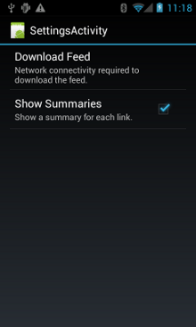

# 管理网络

> 编写:[kesenhoo](https://github.com/kesenhoo) - 原文:<http://developer.android.com/training/basics/network-ops/managing.html>

这一课会介绍如何细化管理使用的网络资源。如果你的程序需要执行很多网络操作，你应该提供用户设置选项来允许用户控制程序的数据偏好。例如，同步数据的频率，是否只在连接到WiFi才进行下载与上传操作，是否在漫游时使用套餐数据流量等等。这样用户才不大可能在快到达流量上限时关闭你的程序获取数据功能，因为他们可以精确控制您的app使用多少数据流量。

关于如何编写一个最小化下载与网络操作对电量影响的程序，请参考：

* [Optimizing Battery Life](http://developer.android.com/training/monitoring-device-state/index.html):
* [Transferring Data Without Draining the Battery](http://developer.android.com/training/efficient-downloads/index.html):

**示例**：[NetworkUsage.zip](http://developer.android.com/shareables/training/NetworkUsage.zip)

## 1)检查设备的网络连接
设备可以有许多种网络连接。这节课主要关注使用Wi-Fi或移动网络连接的情况。关于所有可能的网络连接类型，请看[ConnectivityManager](http://developer.android.com/reference/android/net/ConnectivityManager.html).

通常Wi-Fi是比较快的。移动数据通常都是需要按流量计费，会比较贵。 通常我们会选择让app在连接到WiFi时去获取大量的数据。

那么，我们就需要在执行网络操作之前检查当前连接的网络信息。这样可以防止你的程序不经意连接使用了非意向的网络频道。如果网络连接不可用，你的应用应该优雅的做出响应。为了实现这个目的，我们需要使用到下面两个类：

* [ConnectivityManager](http://developer.android.com/reference/android/net/ConnectivityManager.html): 它会回答关于网络连接状态的查询，同时会在网络连接改变时通知应用程序。
* [NetworkInfo](http://developer.android.com/reference/android/net/NetworkInfo.html): 描述一个给定网络类型(就本节而言是移动网络或Wi-Fi)的网络接口的状态。

这段代码检查了Wi-Fi与移动网络(Mobile)的网络连接。它检查了这些网络接口是否可用(available,也就是说网络连接存在)及是否已连接(connected,也就是说网络连接存在,并且可以建立套接字(socket)来传输数据)：
```java
private static final String DEBUG_TAG = "NetworkStatusExample";
...
ConnectivityManager connMgr = (ConnectivityManager)
        getSystemService(Context.CONNECTIVITY_SERVICE);
NetworkInfo networkInfo = connMgr.getNetworkInfo(ConnectivityManager.TYPE_WIFI);
boolean isWifiConn = networkInfo.isConnected();
networkInfo = connMgr.getNetworkInfo(ConnectivityManager.TYPE_MOBILE);
boolean isMobileConn = networkInfo.isConnected();
Log.d(DEBUG_TAG, "Wifi connected: " + isWifiConn);
Log.d(DEBUG_TAG, "Mobile connected: " + isMobileConn);
```

请注意你不应该仅仅靠网络是否可用(available)做出决策。由于[isConnected()](http://developer.android.com/reference/android/net/NetworkInfo.html#isConnected())能够处理不可靠的移动网络(flaky mobile networks)，飞行模式(airplane mode)，受限制的后台数据(restricted background data)等情况，你应该总是在执行网络操作前检查 [isConnected()](http://developer.android.com/reference/android/net/NetworkInfo.html#isConnected())。

一个更简单的检查网络是否可用的示例如下。[getActiveNetworkInfo()](http://developer.android.com/reference/android/net/ConnectivityManager.html#getActiveNetworkInfo())方法返回一个[NetworkInfo](http://developer.android.com/reference/android/net/NetworkInfo.html)实例，它表示可以找到的第一个已连接的网络接口，如果返回null，则表示没有已连接的网络接口(意味着网络连接不可用)：

```java
public boolean isOnline() {
    ConnectivityManager connMgr = (ConnectivityManager)
            getSystemService(Context.CONNECTIVITY_SERVICE);
    NetworkInfo networkInfo = connMgr.getActiveNetworkInfo();
    return (networkInfo != null && networkInfo.isConnected());
}
```

你可以使用[NetworkInfo.DetailedState](http://developer.android.com/reference/android/net/NetworkInfo.DetailedState.html), 来获取更加详细的网络信息，但很少有这样的必要。

## 2)管理网络的使用
你可以实现一个偏好设置的activity ，来允许用户设置程序的网络资源的使用。例如:

* 你可以允许用户在仅仅连接到Wi-Fi时上传视频。
* 你可以根据诸如网络可用，时间间隔等条件来选择是否做同步的操作。

写一个支持连接网络和管理网络使用的app，你的manifest需要有正确的权限(permission)和意图过滤器(intent filter)：

* [android.permission.INTERNET](http://developer.android.com/reference/android/Manifest.permission.html#INTERNET)—允许应用程序打开网络套接字.
* [android.permission.ACCESS_NETWORK_STATE](http://developer.android.com/reference/android/Manifest.permission.html#ACCESS_NETWORK_STATE)—允许应用程序访问网络连接信息.

你可以为你的activity声明[ACTION_MANAGE_NETWORK_USAGE](http://developer.android.com/reference/android/content/Intent.html#ACTION_MANAGE_NETWORK_USAGE)动作(action)(Android 4.0中引入)的intent filter，这样你的你的activity就能提供控制数据使用的选项了.
[ACTION_MANAGE_NETWORK_USAGE](http://developer.android.com/reference/android/content/Intent.html#ACTION_MANAGE_NETWORK_USAGE)显示管理指定应用程序网络数据使用所需的设置。当你的app有一个允许用户控制网络使用的settings activity时，你应该为你的activity声明这个intent filter。
在章节概览提供的Sample中，这个action被SettingsActivity类处理, 它提供了偏好设置UI来让用户决定何时进行下载。

```xml
<?xml version="1.0" encoding="utf-8"?>
<manifest xmlns:android="http://schemas.android.com/apk/res/android"
    package="com.example.android.networkusage"
    ...>

    <uses-sdk android:minSdkVersion="4"
           android:targetSdkVersion="14" />

    <uses-permission android:name="android.permission.INTERNET" />
    <uses-permission android:name="android.permission.ACCESS_NETWORK_STATE" />

    <application
        ...>
        ...
        <activity android:label="SettingsActivity" android:name=".SettingsActivity">
             <intent-filter>
                <action android:name="android.intent.action.MANAGE_NETWORK_USAGE" />
                <category android:name="android.intent.category.DEFAULT" />
          </intent-filter>
        </activity>
    </application>
</manifest>
```

## 3)实现一个Preferences Activity
正如上面manifest片段中看到的那样，SettingsActivity有一个[ACTION_MANAGE_NETWORK_USAGE](http://developer.android.com/reference/android/content/Intent.html#ACTION_MANAGE_NETWORK_USAGE)的intent filter。SettingsActivity是[PreferenceActivity](http://developer.android.com/reference/android/preference/PreferenceActivity.html)的子类，它展示一个偏好设置页面(如下两张图)让用户指定下面的内容:

* 是否显示每个XML提要条目的总结，或者只是每个条目一个链接。
* 是否在网络连接可用时下载XML提要，或者仅仅在Wi-Fi下下载。




下面是 SettingsActivity. 请注意它实现了[OnSharedPreferenceChangeListener](http://developer.android.com/reference/android/content/SharedPreferences.OnSharedPreferenceChangeListener.html). 当用户改变了他的偏好，就会触发 [onSharedPreferenceChanged()](http://developer.android.com/reference/android/content/SharedPreferences.OnSharedPreferenceChangeListener.html#onSharedPreferenceChanged(android.content.SharedPreferences, java.lang.String)), 这个方法会设置refreshDisplay 为true(这里的变量存在于自己定义的activity，见下一部分的代码示例). 这会使的当用户返回到main activity的时候进行refresh。(请注意，代码中的注释，不得不说，Googler写的Code看起来就是舒服)

```java
public class SettingsActivity extends PreferenceActivity implements OnSharedPreferenceChangeListener {

    @Override
    protected void onCreate(Bundle savedInstanceState) {
        super.onCreate(savedInstanceState);

        // Loads the XML preferences file
        addPreferencesFromResource(R.xml.preferences);
    }

    @Override
    protected void onResume() {
        super.onResume();

        // Registers a listener whenever a key changes
        getPreferenceScreen().getSharedPreferences().registerOnSharedPreferenceChangeListener(this);
    }

    @Override
    protected void onPause() {
        super.onPause();

       // Unregisters the listener set in onResume().
       // It's best practice to unregister listeners when your app isn't using them to cut down on
       // unnecessary system overhead. You do this in onPause().
       getPreferenceScreen().getSharedPreferences().unregisterOnSharedPreferenceChangeListener(this);
    }

    // When the user changes the preferences selection,
    // onSharedPreferenceChanged() restarts the main activity as a new
    // task. Sets the the refreshDisplay flag to "true" to indicate that
    // the main activity should update its display.
    // The main activity queries the PreferenceManager to get the latest settings.

    @Override
    public void onSharedPreferenceChanged(SharedPreferences sharedPreferences, String key) {
        // Sets refreshDisplay to true so that when the user returns to the main
        // activity, the display refreshes to reflect the new settings.
        NetworkActivity.refreshDisplay = true;
    }
}
```

## 4)响应Preference Changes
当用户在设置界面改变了偏好，它通常都会对app的行为产生影响。
在下面的代码示例中，app会在onStart()方法里面检查偏好设置。如果设置的类型与当前设备的网络连接类型相一致，那么程序就会下载数据并刷新显示。(例如, 如果设置是"Wi-Fi" 并且设备连接了Wi-Fi)。(这是一个很好的代码示例，如何选择合适的网络类型进行下载操作)
```java
public class NetworkActivity extends Activity {
    public static final String WIFI = "Wi-Fi";
    public static final String ANY = "Any";
    private static final String URL = "http://stackoverflow.com/feeds/tag?tagnames=android&sort=newest";

    // Whether there is a Wi-Fi connection.
    private static boolean wifiConnected = false;
    // Whether there is a mobile connection.
    private static boolean mobileConnected = false;
    // Whether the display should be refreshed.
    public static boolean refreshDisplay = true;

    // The user's current network preference setting.
    public static String sPref = null;

    // The BroadcastReceiver that tracks network connectivity changes.
    private NetworkReceiver receiver = new NetworkReceiver();

    @Override
    public void onCreate(Bundle savedInstanceState) {
        super.onCreate(savedInstanceState);

        // Registers BroadcastReceiver to track network connection changes.
        IntentFilter filter = new IntentFilter(ConnectivityManager.CONNECTIVITY_ACTION);
        receiver = new NetworkReceiver();
        this.registerReceiver(receiver, filter);
    }

    @Override
    public void onDestroy() {
        super.onDestroy();
        // Unregisters BroadcastReceiver when app is destroyed.
        if (receiver != null) {
            this.unregisterReceiver(receiver);
        }
    }

    // Refreshes the display if the network connection and the
    // pref settings allow it.

    @Override
    public void onStart () {
        super.onStart();

        // Gets the user's network preference settings
        SharedPreferences sharedPrefs = PreferenceManager.getDefaultSharedPreferences(this);

        // Retrieves a string value for the preferences. The second parameter
        // is the default value to use if a preference value is not found.
        sPref = sharedPrefs.getString("listPref", "Wi-Fi");

        updateConnectedFlags();

        if(refreshDisplay){
            loadPage();
        }
    }

    // Checks the network connection and sets the wifiConnected and mobileConnected
    // variables accordingly.
    public void updateConnectedFlags() {
        ConnectivityManager connMgr = (ConnectivityManager)
                getSystemService(Context.CONNECTIVITY_SERVICE);

        NetworkInfo activeInfo = connMgr.getActiveNetworkInfo();
        if (activeInfo != null && activeInfo.isConnected()) {
            wifiConnected = activeInfo.getType() == ConnectivityManager.TYPE_WIFI;
            mobileConnected = activeInfo.getType() == ConnectivityManager.TYPE_MOBILE;
        } else {
            wifiConnected = false;
            mobileConnected = false;
        }
    }

    // Uses AsyncTask subclass to download the XML feed from stackoverflow.com.
    public void loadPage() {
        if (((sPref.equals(ANY)) && (wifiConnected || mobileConnected))
                || ((sPref.equals(WIFI)) && (wifiConnected))) {
            // AsyncTask subclass
            new DownloadXmlTask().execute(URL);
        } else {
            showErrorPage();
        }
    }
...

}
```

## 5)检测网络连接变化
最后一部分是关于 [BroadcastReceiver](http://developer.android.com/reference/android/content/BroadcastReceiver.html) 的子类： NetworkReceiver. 当设备网络连接改变时，NetworkReceiver会监听到 [CONNECTIVITY_ACTION](http://developer.android.com/reference/android/net/ConnectivityManager.html#CONNECTIVITY_ACTION), 这时需要判断当前网络连接类型并相应的设置好 wifiConnected 与 mobileConnected .这样做的结果是下次用户回到app时，app只会下载最新的feed，如果NetworkActivity.refreshDisplay被设置为true，app会更新显示.

我们需要控制好[BroadcastReceiver](http://developer.android.com/reference/android/content/BroadcastReceiver.html)的使用，不必要的声明注册会浪费系统资源。通常是在 onCreate() 去registers 这个BroadcastReceiver ， 在onPause()或者onDestroy() 时unregisters它。这样做会比直接在manifest里面直接注册 <receiver> 更轻量. 当你在manifest里面注册了一个 <receiver> ，你的程序可以在任何时候被唤醒, 即使你已经好几个星期没有使用这个程序了。而通过前面的办法进行注册，可以确保用户离开你的程序之后，不会因为那个Broadcast而被唤起。如果你确保知道何时需要使用到它，你可以在合适的地方使用 [setComponentEnabledSetting()](http://developer.android.com/reference/android/content/pm/PackageManager.html#setComponentEnabledSetting(android.content.ComponentName, int, int)) 来开启或者关闭它。

下面是NetworkReceiver的代码:

```java
public class NetworkReceiver extends BroadcastReceiver {

@Override
public void onReceive(Context context, Intent intent) {
    ConnectivityManager conn =  (ConnectivityManager)
        context.getSystemService(Context.CONNECTIVITY_SERVICE);
    NetworkInfo networkInfo = conn.getActiveNetworkInfo();

    // Checks the user prefs and the network connection. Based on the result, decides whether
    // to refresh the display or keep the current display.
    // If the userpref is Wi-Fi only, checks to see if the device has a Wi-Fi connection.
    if (WIFI.equals(sPref) && networkInfo != null && networkInfo.getType() == ConnectivityManager.TYPE_WIFI) {
        // If device has its Wi-Fi connection, sets refreshDisplay
        // to true. This causes the display to be refreshed when the user
        // returns to the app.
        refreshDisplay = true;
        Toast.makeText(context, R.string.wifi_connected, Toast.LENGTH_SHORT).show();

    // If the setting is ANY network and there is a network connection
    // (which by process of elimination would be mobile), sets refreshDisplay to true.
    } else if (ANY.equals(sPref) && networkInfo != null) {
        refreshDisplay = true;

    // Otherwise, the app can't download content--either because there is no network
    // connection (mobile or Wi-Fi), or because the pref setting is WIFI, and there
    // is no Wi-Fi connection.
    // Sets refreshDisplay to false.
    } else {
        refreshDisplay = false;
        Toast.makeText(context, R.string.lost_connection, Toast.LENGTH_SHORT).show();
    }
}
```
