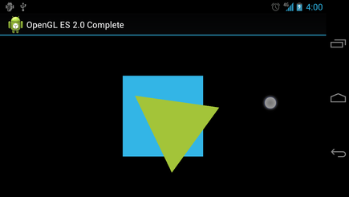

# 响应触摸事件

> 编写:[jdneo](https://github.com/jdneo) - 原文:<http://developer.android.com/training/graphics/opengl/touch.html>

让对象根据预设的程序运动（如让一个三角形旋转），可以有效地引起用户的注意，但是如果你希望可以让OpenGL ES的图形对象与用户交互呢？让你的OpenGL ES应用可以支持触控交互的关键点在于，拓展[GLSurfaceView](http://developer.android.com/reference/android/opengl/GLSurfaceView.html)的实现，重写[onTouchEvent()](http://developer.android.com/reference/android/view/View.html#onTouchEvent(android.view.MotionEvent))方法来监听触摸事件。

这节课将会向你展示如何监听触控事件，让用户旋转一个OpenGL ES对象。

## 配置触摸监听器

为了让你的OpenGL ES应用响应触控事件，你必须实现[GLSurfaceView](http://developer.android.com/reference/android/opengl/GLSurfaceView.html)类中的[onTouchEvent()](http://developer.android.com/reference/android/view/View.html#onTouchEvent(android.view.MotionEvent))方法。下面的例子展示了如何监听[MotionEvent.ACTION_MOVE](http://developer.android.com/reference/android/view/MotionEvent.html#ACTION_MOVE)事件，并将事件转换为形状旋转的角度：

```java
@Override
public boolean onTouchEvent(MotionEvent e) {
    // MotionEvent reports input details from the touch screen
    // and other input controls. In this case, you are only
    // interested in events where the touch position changed.

    float x = e.getX();
    float y = e.getY();

    switch (e.getAction()) {
        case MotionEvent.ACTION_MOVE:

            float dx = x - mPreviousX;
            float dy = y - mPreviousY;

            // reverse direction of rotation above the mid-line
            if (y > getHeight() / 2) {
              dx = dx * -1 ;
            }

            // reverse direction of rotation to left of the mid-line
            if (x < getWidth() / 2) {
              dy = dy * -1 ;
            }

            mRenderer.setAngle(
                    mRenderer.getAngle() +
                    ((dx + dy) * TOUCH_SCALE_FACTOR);  // = 180.0f / 320
            requestRender();
    }

    mPreviousX = x;
    mPreviousY = y;
    return true;
}
```

注意在计算旋转角度后，该方法会调用[requestRender()](http://developer.android.com/reference/android/opengl/GLSurfaceView.html#requestRender())来告诉渲染器现在可以进行渲染了。这种办法对于这个例子来说是最有效的，因为图形并不需要重新绘制，除非有一个旋转角度的变化。当然，为了能够真正实现执行效率的提高，记得使用[setRenderMode()](http://developer.android.com/reference/android/opengl/GLSurfaceView.html#setRenderMode(int))方法以保证渲染器仅在数据发生变化时才会重新绘制图形，所以请确保这一行代码没有被注释掉：

```java
public MyGLSurfaceView(Context context) {
    ...
    // Render the view only when there is a change in the drawing data
    setRenderMode(GLSurfaceView.RENDERMODE_WHEN_DIRTY);
}
```

## 公开旋转角度

上述样例代码需要你公开旋转的角度，方法是在你的渲染器中添加一个`public`成员变量。由于渲染器代码运行在一个独立的线程中（非主UI线程），你必须同时将该变量声明为volatile。注意下面声明该变量的代码，另外对应的get和set方法也被声明为了`public`成员函数：

```java
public class MyGLRenderer implements GLSurfaceView.Renderer {
    ...

    public volatile float mAngle;

    public float getAngle() {
        return mAngle;
    }

    public void setAngle(float angle) {
        mAngle = angle;
    }
}
```

## 应用旋转

为了应用触控输入所生成的旋转，注释掉创建旋转角度的代码，然后添加`mAngle`，该变量包含了触控输入所生成的角度：

```java
public void onDrawFrame(GL10 gl) {
    ...
    float[] scratch = new float[16];

    // Create a rotation for the triangle
    // long time = SystemClock.uptimeMillis() % 4000L;
    // float angle = 0.090f * ((int) time);
    Matrix.setRotateM(mRotationMatrix, 0, mAngle, 0, 0, -1.0f);

    // Combine the rotation matrix with the projection and camera view
    // Note that the mMVPMatrix factor *must be first* in order
    // for the matrix multiplication product to be correct.
    Matrix.multiplyMM(scratch, 0, mMVPMatrix, 0, mRotationMatrix, 0);

    // Draw triangle
    mTriangle.draw(scratch);
}
```

当你完成了上述步骤，你就可以运行这个程序，并通过手指在屏幕上的滑动旋转三角形了：


