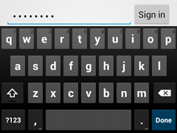

# 指定输入法类型

> 编写:[zhaochunqi](https://github.com/zhaochunqi) - 原文:<http://developer.android.com/training/keyboard-input/style.html>

每个文本域期待特定的文本类型，如Email，电话号码，或者纯文本。为应用中的每一个文本域指定特定的输入类型以便系统展示更为合适的软键盘输入法(比如屏幕上键盘)是很重要的。

## 指定键盘类型

你总是可以为你的文本域定义输入法通过添加[android:inputType](http://developer.android.com/reference/android/widget/TextView.html#attr_android:inputType) 属性到 [&lt;EditText&gt;](http://developer.android.com/reference/android/widget/EditText.html) 元素中。

举例来说，如果你想要一个为输入电话号码的输入法，使用"phone"值:


```xml
<EditText
    android:id="@+id/phone"
    android:layout_width="fill_parent"
    android:layout_height="wrap_content"
    android:hint="@string/phone_hint"
    android:inputType="phone" />
```

或着如果文本域是密码，使用"textPassword"值来隐藏用户的输入:


```xml
<EditText
    android:id="@+id/password"
    android:hint="@string/password_hint"
    android:inputType="textPassword"
    ... />
```
有几种可供选择的值在android:inputType属性中记录，一些值可以组合起来实现特定的输入法表现和附加的行为。

## 开启拼写建议和其他的行为

android:inputType属性允许你为输入法指定不同的行为。最为重要的是，如果你的文本域是为基本的文本输入( 如短信息)，你应该使用"textAutoCorrect"来开启拼写检查。

你可以组合不同的行为和输入法形式通过textAutoCorrect这个属性。如：如何创建一个文本域句子单词的首字母答谢并开启拼写检查：

```xml
<EditText
    android:id="@+id/message"
    android:layout_width="wrap_content"
    android:layout_height="wrap_content"
    android:inputType=
        "textCapSentences|textAutoCorrect"
    ... />
```

## 指定输入法的行为

多数的软键盘会在底部角落里为用户提供一个合适的动作按钮来触发当前文本域的操作。默认情况下，系统使用**下一步(Next)**或者**确认(DONE)**除非你的文本域允许多行(如android:inputType="textMultiLine")，这种情况下，动作按钮就是回车换行。然而，你可以制定额外的动作一边更适合你的文本域，比如**SEND**和**GO**。

指定特定的动作按钮，将 [android:imeOptions](http://developer.android.com/reference/android/widget/TextView.html#attr_android:imeOptions) 属性的值设为"actionSend" 或 "actionSearch"。如：

```xml
<EditText
    android:id="@+id/search"
    android:layout_width="fill_parent"
    android:layout_height="wrap_content"
    android:hint="@string/search_hint"
    android:inputType="text"
    android:imeOptions="actionSend" />
```
然后你可以通过为 [EditText](http://developer.android.com/reference/android/widget/EditText.html)定义[TextView.OnEditorActionListener](http://developer.android.com/reference/android/widget/TextView.OnEditorActionListener.html)来监听动作按钮的启动。在监听器中，对输入法编辑器对合适的回应的动作ID对应在 [EditorInfo](http://developer.android.com/reference/android/view/inputmethod/EditorInfo.html) 类中，如 [IME_ACTION_SEND](http://developer.android.com/reference/android/view/inputmethod/EditorInfo.html#IME_ACTION_SEND) 。例如:

```java
EditText editText = (EditText) findViewById(R.id.search);
editText.setOnEditorActionListener(new OnEditorActionListener() {
    @Override
    public boolean onEditorAction(TextView v, int actionId, KeyEvent event) {
        boolean handled = false;
        if (actionId == EditorInfo.IME_ACTION_SEND) {
            sendMessage();
            handled = true;
        }
        return handled;
    }
});
```


