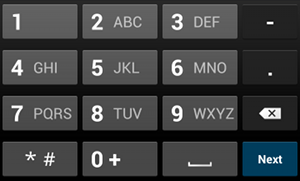

# 指定输入法类型

> 编写:[zhaochunqi](https://github.com/zhaochunqi) - 原文:<http://developer.android.com/training/keyboard-input/style.html>

每个文本框都对应特定类型的文本输入，如Email地址，电话号码，或者纯文本。为应用中的每一个文本框指定输入类型是很重要的，这样做可以让系统展示更为合适的软输入法（比如屏幕上的键盘）。

除了输入法可用的按钮类型之外，我们还应该指定一些行为，例如，输入法是否提供拼写建议，新的句子首字母大写，和将回车按钮替换成动作按钮（如 **Done** 或者 **Next**）。这节课介绍了如何添加这些属性。

## 指定键盘类型

通过将 [android:inputType](http://developer.android.com/reference/android/widget/TextView.html#attr_android:inputType) 属性添加到 [&lt;EditText&gt;](http://developer.android.com/reference/android/widget/EditText.html) 节点中，我们可以为文本框声明输入法。

举例来说，如果我们想要一个用于输入电话号码的输入法，那么使用 `"phone"` 值：

```xml
<EditText
    android:id="@+id/phone"
    android:layout_width="fill_parent"
    android:layout_height="wrap_content"
    android:hint="@string/phone_hint"
    android:inputType="phone" />
```



**Figure 1.** `phone` 输入类型

或者如果文本框用于输入密码，那么使用 `"textPassword"` 值来隐藏用户的输入：

```xml
<EditText
    android:id="@+id/password"
    android:hint="@string/password_hint"
    android:inputType="textPassword"
    ... />
```


**Figure 2.** `textPassword` 输入类型

有几种可供选择的值在 `android:inputType` 记录在属性中，一些值可以组合起来实现特定的输入法外观和附加的行为。

## 开启拼写建议和其它行为

[android:inputType](http://developer.android.com/reference/android/widget/TextView.html#attr_android:inputType) 属性允许我们为输入法指定不同的行为。最为重要的是，如果文本框用于基本的文本输入（如短信息），那么我们应该使用 `"textAutoCorrect"` 值来开启自动拼写修正。


**Figure 3.** 添加 `textAutoCorrect` 为拼写错误提供自动修正

我们可以将不同的行为和输入法形式组合到 [android:inputType](http://developer.android.com/reference/android/widget/TextView.html#attr_android:inputType) 这个属性。如：如何创建一个文本框，里面的句子首字母大写并开启拼写修正：

```xml
<EditText
    android:id="@+id/message"
    android:layout_width="wrap_content"
    android:layout_height="wrap_content"
    android:inputType=
        "textCapSentences|textAutoCorrect"
    ... />
```

## 指定输入法的行为

多数的软键盘会在底部角落里为用户提供一个合适的动作按钮来触发当前文本框的操作。默认情况下，系统使用 **Next** 或者 **Done**，除非我们的文本框允许多行文本（如`android:inputType="textMultiLine"`），这种情况下，动作按钮就是回车换行。然而，我们可以指定一些更适合我们文本框的额外动作，比如 **Send** 和 **Go**。


**Figure 4.** 当我们声明了 `android:imeOptions="actionSend"`，会出现 Send 按钮。

使用[android:imeOptions](http://developer.android.com/reference/android/widget/TextView.html#attr_android:imeOptions) 属性，并设置一个动作值（如 `"actionSend"` 或 `"actionSearch"`），来指定键盘的动作按钮。如：

```xml
<EditText
    android:id="@+id/search"
    android:layout_width="fill_parent"
    android:layout_height="wrap_content"
    android:hint="@string/search_hint"
    android:inputType="text"
    android:imeOptions="actionSend" />
```

然后，我们可以通过为 [EditText](http://developer.android.com/reference/android/widget/EditText.html) 节点定义 [TextView.OnEditorActionListener](http://developer.android.com/reference/android/widget/TextView.OnEditorActionListener.html) 来监听动作按钮的按压。在监听器中，响应 [EditorInfo](http://developer.android.com/reference/android/view/inputmethod/EditorInfo.html) 类中定义的适合的 IME action ID，如 [IME_ACTION_SEND](http://developer.android.com/reference/android/view/inputmethod/EditorInfo.html#IME_ACTION_SEND) 。例如:

```java
EditText editText = (EditText) findViewById(R.id.search);
editText.setOnEditorActionListener(new OnEditorActionListener() {
    @Override
    public boolean onEditorAction(TextView v, int actionId, KeyEvent event) {
        boolean handled = false;
        if (actionId == EditorInfo.IME_ACTION_SEND) {
            sendMessage();
            handled = true;
        }
        return handled;
    }
});
```


