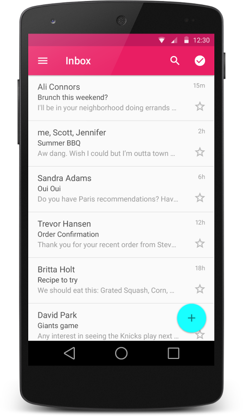
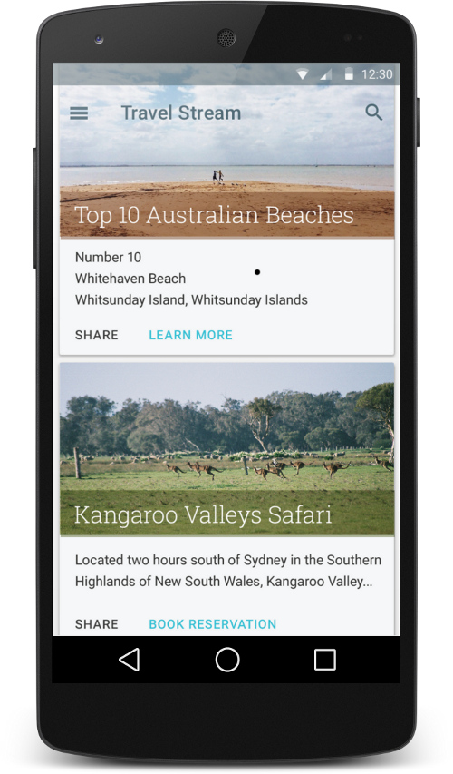

# 创建Lists与Cards

> 编写: [allenlsy](https://github.com/allenlsy) - 原文: <https://developer.android.com/training/material/lists-cards.html>

要在应用中创建复杂的列表和使用 Material Design 的卡片列表，你可以使用 [`RecyclerView`](http://developer.android.com/reference/android/support/v7/widget/RecyclerView.html) 和 [`CardView`](http://developer.android.com/reference/android/support/v7/widget/CardView.html)。

## 创建列表

`RecyclerView` 组件是一个更高级和伸缩性更强的 ListView。这个组件是一个显示大量数据的容器，通过维护有限量的View，来达到滚动时的高效。当你的数据集在运行过程中会根据用户行为或网络事件更新时，应该使用 `RecyclerView`。

`RecyclerView` 通过以下方式简化显示流程，并操作大量数据：

* 使用 Layout manager 来定位元素
* 为常用操作定义默认动画，比如添加或移除元素

你也可以为 RecyclerView 自定义 Layout manager 和动画。


要使用 RecyclerView 组件，你需要定义一个 adapter 和 layout manager。创建 adapter，要继承 `RecyclerView.Adapter` 类。实现类的细节取决于你的数据集和视图类型。更多信息，请看以下样例。



Layout manager 把元素视图放在 RecyclerView，并决定什么时候重用不可见的元素视图。要重用（或回收）视图时，layout manager 会让 adapter 用另外的元素内容替换视图内的内容。回收 View 这个方法能提高性能，因为它避免了创建不必要的view对象，或执行昂贵的 `findViewById()` 查找。

`RecyclerView` 提供以下内建的 layout manager:

* `LinearLayoutManager` 用于显示横向或纵向的滚动列表
* `GridLayoutManager` 用于显示方格元素
* `StaggeredGridLayoutManager` 在 staggered 方格中显示元素

创建一个自定义的 layout manager，要继承于 `RecyclerView.LayoutManager` 类

## 动画

添加和删除元素的动画在 RecyclerView 中是默认被启用的。要自定义动画，你需要继承`RecyclerView.ItemAnimator` 类，使用`RecyclerView.setItemAnimator()`方法。

### 例子

以下代码示例了如何添加 RecyclerView 到一个 Layout :

```xml
<!-- A RecyclerView with some commonly used attributes -->
<android.support.v7.widget.RecyclerView
    android:id="@+id/my_recycler_view"
    android:scrollbars="vertical"
    android:layout_width="match_parent"
    android:layout_height="match_parent"/>
```

添加 RecyclerView 组件到Layout之后，获得一个到 RecyclerView 的对象，连接它到 Layout manager，再附上 adapter 用于数据显示：

```java
public class MyActivity extends Activity {
    private RecyclerView mRecyclerView;
    private RecyclerView.Adapter mAdapter;
    private RecyclerView.LayoutManager mLayoutManager;

    @Override
    protected void onCreate(Bundle savedInstanceState) {
        super.onCreate(savedInstanceState);
        setContentView(R.layout.my_activity);
        mRecyclerView = (RecyclerView) findViewById(R.id.my_recycler_view);

        // use this setting to improve performance if you know that changes
        // in content do not change the layout size of the RecyclerView
        mRecyclerView.setHasFixedSize(true);

        // use a linear layout manager
        mLayoutManager = new LinearLayoutManager(this);
        mRecyclerView.setLayoutManager(mLayoutManager);

        // specify an adapter (see also next example)
        mAdapter = new MyAdapter(myDataset);
        mRecyclerView.setAdapter(mAdapter);
    }
    ...
}
```

Adapter 支持获取数据集元素，创建元素的视图，并可以将新元素的内容去替代不可见元素视图中的内容。以下代码展示了一个简单的实现，其中的数据集包含了一个字符串数组，数据元素用 TextView 显示：

```java

public class MyAdapter extends RecyclerView.Adapter<MyAdapter.ViewHolder> {
    private String[] mDataset;

    // Provide a reference to the views for each data item
    // Complex data items may need more than one view per item, and
    // you provide access to all the views for a data item in a view holder
    public static class ViewHolder extends RecyclerView.ViewHolder {
        // each data item is just a string in this case
        public TextView mTextView;
        public ViewHolder(TextView v) {
            super(v);
            mTextView = v;
        }
    }

    // Provide a suitable constructor (depends on the kind of dataset)
    public MyAdapter(String[] myDataset) {
        mDataset = myDataset;
    }

    // Create new views (invoked by the layout manager)
    @Override
    public MyAdapter.ViewHolder onCreateViewHolder(ViewGroup parent,
                                                   int viewType) {
        // create a new view
        View v = LayoutInflater.from(parent.getContext())
                               .inflate(R.layout.my_text_view, parent, false);
        // set the view's size, margins, paddings and layout parameters
        ...
        ViewHolder vh = new ViewHolder(v);
        return vh;
    }

    // Replace the contents of a view (invoked by the layout manager)
    @Override
    public void onBindViewHolder(ViewHolder holder, int position) {
        // - get element from your dataset at this position
        // - replace the contents of the view with that element
        holder.mTextView.setText(mDataset[position]);

    }

    // Return the size of your dataset (invoked by the layout manager)
    @Override
    public int getItemCount() {
        return mDataset.length;
    }
}

```

## 创建卡片



CardView 继承于 FrameLayout 类，它可以在卡片中显示信息，并保持在不同平台上拥有统一的风格。CardView 组件可以设定阴影和圆角。

要创建一个带阴影的卡片，使用 `card_view:cardElevation` 属性。CardView 使用了Android 5.0 (API level 21)中的真实高度值以及动态阴影效果，在 5.0 以下的版本中有编程实现阴影的备选方案。更多内容，请参见保持兼容性章节。

使用以下属性来自定义CardView：

* 使用`card_view:cardCornerRadius`在layout中设置圆角
* 使用`CardView.setRadius`在代码中设置圆角
* 使用`card_view:carBackgroundColor`来设置背景颜色

以下代码展示如何在layout中添加CardView:

```xml
<LinearLayout xmlns:android="http://schemas.android.com/apk/res/android"
    xmlns:tools="http://schemas.android.com/tools"
    xmlns:card_view="http://schemas.android.com/apk/res-auto"
    ... >
    <!-- A CardView that contains a TextView -->
    <android.support.v7.widget.CardView
        xmlns:card_view="http://schemas.android.com/apk/res-auto"
        android:id="@+id/card_view"
        android:layout_gravity="center"
        android:layout_width="200dp"
        android:layout_height="200dp"
        card_view:cardCornerRadius="4dp">

        <TextView
            android:id="@+id/info_text"
            android:layout_width="match_parent"
            android:layout_height="match_parent" />
    </android.support.v7.widget.CardView>
</LinearLayout>

```

更多信息，参见CardView的API文档。

## 添加依赖

RecyclerView和CardView都是v7 support 库的一部分。要使用这两个组件，在你的Gradle依赖中添加两个模块：

```
dependencies {
    ...
    compile 'com.android.support:cardview-v7:21.0.+'
    compile 'com.android.support:recyclerview-v7:21.0.+'
}
```
