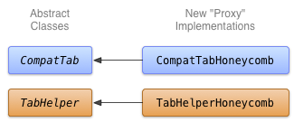

# 代理至新的APIs

> 编写: [spencer198711](https://github.com/spencer198711) - 原文:<http://developer.android.com/training/backward-compatible-ui/new-implementation.html>

这一课展示了如何编写CompatTab和TabHelper等抽象类的子类，并且使用了较新的APIs。你的应用可以在支持这些新的APIs的平台版本的设备上使用这种实现方式。

## 使用较新的APIs实现Tabs

CompatTab和TabHelper抽象类的具体子类是一种代理实现，它们使用了使用较新的APIs。由于抽象类在之前的课程中定义并且是对新APIs接口（类结构、方法签名等等）的镜像，使用新APIs的具体子类只是简单的代理方法调用和方法调用的结果。

你可以在这些具体子类中直接使用较新的APIs，由于使用延迟类加载的方式，在早期版本的设备上并不会发生崩溃现象。这些类在首次次被访问（实例化类对象或者访问类的静态属性或静态方法）的时候才会去加载并初始化。因此，只要你不在Honeycomb之前的设备上实例化Honeycomb相关的实现，dalvik虚拟机都不会抛出[VerifyError](http://developer.android.com/reference/java/lang/VerifyError.html)异常。

对于本实现，一个比较好的命名约定是把具体子类需要的API等级或者版本名字附加在APIs接口的后边。例如，本地tab实现可以由CompatTabHoneycomb和abHelperHoneycomb这两个类提供，名字后面附加Honeycomb是由于它们都依赖于Android 3.0（API等级11）之后版本的APIs。



* 图1. Honeycomb上tabs实现的类关系图.

## 实现CompatTabHoneycomb

CompatTabHoneycomb是CompatTab抽象类的具体实现并用来引用单独的tabs。CompatTabHoneycomb只是简单的代理[ActionBar.Tab](http://developer.android.com/reference/android/app/ActionBar.Tab.html)对象的方法调用。
开始使用ActionBar.Tab的APIs实现CompatTabHoneycomb：

```java
public class CompatTabHoneycomb extends CompatTab {
    // The native tab object that this CompatTab acts as a proxy for.
    ActionBar.Tab mTab;
    ...
	protected CompatTabHoneycomb(FragmentActivity activity, String tag) {
        ...
        // Proxy to new ActionBar.newTab API
        mTab = activity.getActionBar().newTab();
    }
	public CompatTab setText(int resId) {
        // Proxy to new ActionBar.Tab.setText API
        mTab.setText(resId);
        return this;
    }
	...
    // Do the same for other properties (icon, callback, etc.)
}
```

## 实现TabHelperHoneycomb

TabHelperHoneycomb是TabHelper抽象类的具体实现，TabHelperHoneycomb代理方法调用到[ActionBar](http://developer.android.com/reference/android/app/ActionBar.html)对象，而这个ActionBar对象是从包含他的Activity中获取的。

实现TabHelperHoneycomb，代理其方法调用到ActionBar的API：

```java
public class TabHelperHoneycomb extends TabHelper {
    ActionBar mActionBar;
    ...

    protected void setUp() {
        if (mActionBar == null) {
            mActionBar = mActivity.getActionBar();
            mActionBar.setNavigationMode(
                    ActionBar.NAVIGATION_MODE_TABS);
        }
    }

    public void addTab(CompatTab tab) {
        ...
        // Tab is a CompatTabHoneycomb instance, so its
        // native tab object is an ActionBar.Tab.
        mActionBar.addTab((ActionBar.Tab) tab.getTab());
    }

    // The other important method, newTab() is part of
    // the base implementation.
}
```
