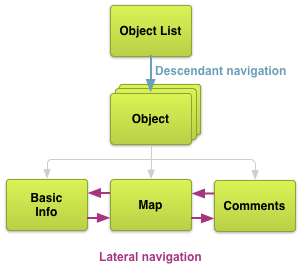
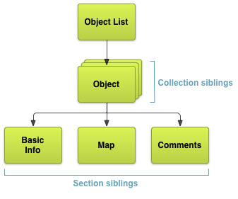
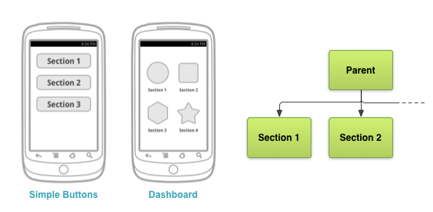

# 提供向下与横向导航

> 编写:[XizhiXu](https://github.com/XizhiXu) - 原文:<http://developer.android.com/training/design-navigation/descendant-lateral.html>

一种提供查看应用整体界面结构的方式就是显示层级导航。这节课我们讨论 *向下导航*，它允许用户进入子界面。我们还讨论 *横向* 导航，它允许用户访问同级界面。

**Figure 1.** 向下和横向导航

有两种同级界面：容器关联和区块关联界面。*容器关联（Collection-related)* 界面展示由父界面放入同个容器里地那些条目。*区块关联(Section-related)* 界面展示父界面不同部分的信息，例如：一个部分可能展示某对象的文字信息，可是另一个部分则提供对象地理位置的地图。一个父界面的区块关联界面数量通常较少。

**Figure 2.** 容器关联子界面和区块关联子界面。

向下和横向导航可用List（列表），Tab（标签）或者其他 UI 模式来实现。 *UI 模式*, 与软件设计模式很类似，是重复交互设计问题的一般化解决方案。下几章，我们将探究一些常用的横向导航模式。

## Button和简单的控件

> **Button设计**

> 设计指南请阅读 Android 设计文档的[Button](http://developer.android.com/design/building-blocks/buttons.html)指导

对于区块关联的界面，最直接和熟悉的导航界面就是提供可触或键盘可得焦点的控件。例如，Button，固定大小的 List View 或 文本链接，虽然后者不是一个触屏导航的理想 UI 元素。一旦点选了这些控件，子界面被打开，完全替代当前上下文环境（屏幕）。Button或其他简单地控件很少被用来呈现容器中的项目。

**Figure 3.** Button导航模式例子和对应界面图。Dashboard 模式见下文。

Dashboard（操作面板）模式是一种一般以Button为主来获取不同应用划分模块的模式。一个dashboard就是个大图标Button表格，它表示了父界面绝大部分内容。这个表格通常是2、3行或列，取决于 App 的顶层划分。此模式展示全部区块的视觉效果非常丰富。巨大的触摸控件也让 UI 特别好使。当每个区块都同等重要时，Dashboard模式最好用。然而，这个模式在大屏上效果不佳，他让用户直接获取 App 内容时多走了一步弯路。

还有更多套用了各种其他 UI 模式来提升内容即得性和独特的展示效果，但仍保持着直观特点的高级 UI 模式。

## Lists, Grids, Carousels, and Stacks

> **List 和 Grid List 设计**

> 设计指南请阅读 Android 设计文档的[Lists](http://developer.android.com/design/building-blocks/lists.html)和[Grid Lists](http://developer.android.com/design/building-blocks/grid-lists.html)指导。

对于容器关联的界面，特别是文字信息，垂直滑动列表通常是最直接最熟悉的做法。对于视觉更丰富的内容（例如，图片，视频），可用垂直滑动的 Grid，水平滚动的 List（有时被叫做 Carousel），或 Stack（有时叫做卡片，Card）来代替。这些 UI 元素通常用在呈现容器内的条目，或大量子界面最好，而不是零星的毫无关联的同级子界面。

**Figure 4.** 控件例子和对应界面图

这个模式还有些问题。深层列表导航常常叫 drill-down（钻井）列表导航，它的list层层嵌套。这种导航笨拙低效。获得某块内容需要点击多次，带给用户很差的体验，特别是活跃用户。

使用纵向list也可能带来尴尬的用户交互，并且如果list条目简单地的拉伸话也可能用不好大屏空白。解决方法就是提供额外的信息，例如用文字汇总填充那些可用的水平空间。或者在左右添加个视窗。

## Tabs（标签）

> **Tab 设计**

> 设计指南请阅读 Android 设计文档的[Tab](http://developer.android.com/design/building-blocks/tabs.html)指导

Tab是非常流行的横向导航。这个模式允许组合同级界面，就是说tab可嵌入原本可能成为另一个界面的子界面内容。Tab适合用在小量的区块关联界面。

**Figure 5.** 手机和平板导航例子和对应界面图

几个使用Tab时的最佳做法。Tab在关联界面种应该一直存在，只有指定内容区域发生改变，并且tab提示在任何时候都可用。此外，tab切换不能算作历史。例如，如果用户从 Tab *A* 切换到 Tab *B*，按 *Back* 按钮（详情看[下节](ancestral-temporal.html)）不该重选 Tab *A*。Tab通常水平排布，可是有时其他tab展现形式，例如Action bar（详见Android 设计的[模式](http://developer.android.com/design/patterns/actionbar.html)章节）的下拉菜单，也是可以的。最后，最重要的是，tab应该在界面顶端和内容对应。

tab导航相对于list和button导航，有很多即得的优点：

* 既然只有一个初始时既选的活动tab，用户能立即从界面获取tab的内容。

* 用户可在相关界面内快速导航，不用重新访问父界面。

  > **注意：** 当切换Tab时，保证立即切换很重要。不要加载时弹个确认对话框来阻塞tab的访问。

导致这个模式被批评常见的原因就是必须从展示内容的屏幕空间分一些给tab提示栏。但是结果还能接受，权衡一般都向使用此模式的方向倾斜。你可以随意个性化你的tab提示栏，加点文字或图标什么的让纵向空间合理利用。但是调整tab宽度时，请确保tab够大到能让人无误点击。

## 水平分页（Swipe View）

> **Swipe View 设计**

> 设计指南请阅读 Android 设计文档的[Swipe View](http://developer.android.com/design/patterns/swipe-views.html)指导

另一种横向导航的模式就是水平分页，也叫做 Swipe View。这个模式在容器关联的同级界面上最好用，例如类别列表（世界，金融，技术和健康新闻）。就像Tab，这个模式也允许组合界面，这样父界面就能在布局内嵌入子界面的内容。

**Figure 6.** 水平分页导航例子和对应界面图

在水平分页 UI 中，一次只展示一个子界面（这儿叫*页*，*page*）。用户能通过触摸屏幕然后按想要访问相邻页面的方向拖拽导航到同级界面。为补充这种手势交互通常由另一种 UI 元素提示当前页和可访问页。这样能帮助用户发觉内容并且也提供了更多的上下文环境信息给用户。当为区块关联的同级模块使用这种模式的水平导航时，这个做法很有必要。这些提示界面元素的例子包括点标（tick  mark），滑动标注（scrolling label）和标签（tab）：

**Figure 7.** 搭配分页的 UI 元件。

当子界面包含水平平移视图时（例如地图）也最好避免使用这种模式，因为这些冲突的交互会威胁你界面的易用性。

此外，对于同级关联界面，如果内容类型具有一定相似性而且同级界面数量较少时，水平分页再适合不过了。就这一点，这个模式可以和tab一起用。tab放在内容上方来最大化界面直观性。对于容器关联界面，当界面间有天然的顺序时，水平分页是最符合直觉的，例如页面代表连续的日历日。对于无穷无尽的数据，特别是双向都有内容数据，分页机制效果非常棒。

下节课，我们讨论在内容层级中允许用户往上和回退到之前访问界面的导航的机制。

[下节课：提供向上和时间导航](ancestral-temporal.html)

