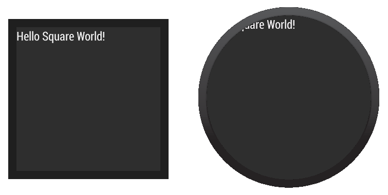
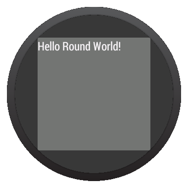

# 定义Layouts

> 编写: [roya](https://github.com/RoyaAoki) 原文:<https://developer.android.com/training/wearables/ui/layouts.html>

<!--Wearables use the same layout techniques as handheld Android devices, but need to be designed with specific constraints. Do not port functionality and the UI from a handheld app and expect a good experience. For more information on how to design great wearable apps, read the Android Wear Design Guidelines.-->
可穿戴设备使用与手持Android设备同样的布局技术，但需要有具体的约束来设计。不要以一个手持app的角度开发功能和UI以期待提供一个好的体验。关于如何设计优秀的可穿戴apps的更多信息，请阅读[Android Wear Design Guidelines](https://developer.android.com/design/wear/index.html)。

<!--When you create layouts for Android Wear apps, you need to account for devices with square and round screens. Any content placed near the corners of the screen may be cropped on round Android Wear devices, so layouts designed for square screens do not work well on round devices. For a demonstration of this type of problem, see the video Full Screen Apps for Android Wear.-->
当你为Android Wear apps创建layouts时，你需要同时考虑方形和圆形屏幕的设备。在圆形Android Wear设备上所有放置在靠近屏幕边角的内容会被剪裁掉，所以为方形屏幕设计的layouts不能在圆形设备上很好的工作。对这类问题是示范请查看这个视屏[Full Screen Apps for Android Wear](https://www.youtube.com/watch?v=naf_WbtFAlY)。

<!--For example, figure 1 shows how the following layout looks on square and round screens:-->
举个例子，figure 1展示了下面的layout在圆形和方形屏幕上看起来是怎样的：

<!--Figure 1. Demonstration of how a layout designed for square screens does not work well on round screens.-->
**Figure 1.** *为方形屏幕设计的layouts不能在圆形设备上很好工作的示范*

    <LinearLayout xmlns:android="http://schemas.android.com/apk/res/android"
    xmlns:tools="http://schemas.android.com/tools"
    android:layout_width="match_parent"
    android:layout_height="match_parent"
    android:orientation="vertical">

    <TextView
        android:id="@+id/text"
        android:layout_width="wrap_content"
        android:layout_height="wrap_content"
        android:text="@string/hello_square" />
    </LinearLayout>
    
<!--The text does not display correctly on devices with round screens.-->
text没有正确的显示在圆形屏幕上。

<!--The Wearable UI Library provides two different approaches to solve this problem:-->
Wearable UI Library为这个问题提供了两种不同的解决方案：

<!--Define different layouts for square and round devices. Your app detects the shape of the device screen and inflates the correct layout at runtime.-->
* 为圆形和方形屏幕定义不同的layouts。你的app会在运行时检查设备屏幕形状后inflates正确的layout。

<!--Use a special layout included in the library for both square and round devices. This layout applies different window insets depending on the shape of the device screen.-->
* 用一个包含在library里面的特殊layout同时适配方形和圆形设备。这个layout会在不同形状的设备屏幕窗口中插入间隔。

<!--You typically use the first approach when you want your app to look different depending on the shape of the device screen. You use the second approach when you want to use a similar layout on both screen shapes without having views cropped near the edges of round screens.-->
当你希望你的app在不同形状的屏幕上看起来不同时，你可以典型的使用第一种方案。当你希望用一个相似的layout在两种屏幕上且在圆形屏幕上没有视图被边缘剪裁时，你可以使用第二种方案。

<!--Add the Wearable UI Library-->
## 添加Wearable UI库

<!--Android Studio includes the Wearable UI Library on your wear module by default when you use the Project Wizard. To compile your project with this library, ensure that the Extras > Google Repository package is installed in the Android SDK manager and that the following dependency is included in the build.gradle file of your wear module:-->
Android Studio会在你使用工程向导时includes你在**wear** module中的Wearable UI库。为了编译你的工程和这个库，确保 *Extras > Google Repository* 包已经被安装在Android SDK manager里、以下的**wear** module依赖被包含在你的**build.gradle**文件中。

    dependencies {
	    compile fileTree(dir: 'libs', include: ['*.jar'])
	    compile 'com.google.android.support:wearable:+'
	    compile 'com.google.android.gms:play-services-wearable:+'
    }
    
<!--The 'com.google.android.support:wearable' dependency is required to implement the layout techniques shown in the following sections.-->
要实现以下的布局方法 **'com.google.android.support:wearable'** 依赖是必须的。

<!--Browse the API reference documentation for the Wearable UI Library classes.-->
浏览[API reference documentation](https://developer.android.com/reference/android/support/wearable/view/package-summary.html)查看Wearable UI类库。

<!--Specify Different Layouts for Square and Round Screens-->
## 为方形和圆形屏幕指定不同的Layouts

<!--The WatchViewStub class included in the Wearable UI Library lets you specify different layout definitions for square and round screens. This class detects the screen shape at runtime and inflates the corresponding layout.-->
在Wearable UI库中的**WatchViewStub**类允许你为方形和圆形屏幕指定不同的layouts。这个类会在运行时检查屏幕形状后inflates符合的layout。

<!--To use this class for handling different screen shapes in your app:-->
在你的app中使用这个类以应对不用和的屏幕形状：

<!--Add WatchViewStub as the main element of your activity's layout.
Specify a layout definition file for square screens with the rectLayout attribute.
Specify a layout definition file for round screens with the roundLayout attribute.-->

* 在你的activity's layout以WatchViewStub为主元素。
* 为方形屏幕指定一个layout解释文件使用rectLayout属性。
* 为圆形屏幕指定一个layout解释文件使用roundLayout属性。

<!--Define your activity's layout as follows:-->
定义你的activity's layout类似于：

	<android.support.wearable.view.WatchViewStub
	    xmlns:android="http://schemas.android.com/apk/res/android"
	    xmlns:app="http://schemas.android.com/apk/res-auto"
	    xmlns:tools="http://schemas.android.com/tools"
	    android:id="@+id/watch_view_stub"
	    android:layout_width="match_parent"
	    android:layout_height="match_parent"
	    app:rectLayout="@layout/rect_activity_wear"
	    app:roundLayout="@layout/round_activity_wear">
	</android.support.wearable.view.WatchViewStub>
	
<!--Inflate this layout in your activity:-->
在你的activity中inflate这个layout：

	@Override
	protected void onCreate(Bundle savedInstanceState) {
	    super.onCreate(savedInstanceState);
	    setContentView(R.layout.activity_wear);
	}
	
<!--Then create different layout definition files for square and round screens. In this example, you need to create the files res/layout/rect_activity_wear.xml and res/layout/round_activity_wear.xml. You define these layouts in the same way that you create layouts for handheld apps, but taking into account the constraints of wearable devices. The system inflates the correct layout at runtime depending on the screen shape.-->

然后为方形和圆形屏幕创建不同的layout描述文件，在这个例子中，你需要创建文件 *res/layout/rect\_activity\_wear.xml* 和 *res/layout/round\_activity\_wear.xml* 。像创建手持apps的layouts一样定义这些layouts，但同时考虑可穿戴设备的限制。系统会在运行时以屏幕形状inflates适合的layout。

<!--Accessing layout views-->
## 取得layout views

<!--The layouts that you specify for square or round screens are not inflated until WatchViewStub detects the shape of the screen, so your app cannot access their views immediately. To access these views, set a listener in your activity to be notified when the shape-specific layout has been inflated:-->
你为方形或圆形屏幕定义的layouts在WatchViewStub检查完屏幕形状之前不会被inflated。所以你的app不能立即取得它们的views。为了取得这些views，你需要在你的activity中设置一个listener，当屏幕适配的layout被inflated时会通知这个listener：

	@Override
	protected void onCreate(Bundle savedInstanceState) {
	    super.onCreate(savedInstanceState);
	    setContentView(R.layout.activity_wear);

	    WatchViewStub stub = (WatchViewStub) findViewById(R.id.watch_view_stub);
	    stub.setOnLayoutInflatedListener(new WatchViewStub.OnLayoutInflatedListener() {
	        @Override public void onLayoutInflated(WatchViewStub stub) {
	            // Now you can access your views
	            TextView tv = (TextView) stub.findViewById(R.id.text);
	            ...
	        }
	    });
	}
	
<!--Use a Shape-Aware Layout-->
## 使用形状感知的Layout

<!--The BoxInsetLayout class included in the Wearable UI Library extends FrameLayout and lets you define a single layout that works for both square and round screens. This class applies the required window insets depending on the screen shape and lets you easily align views on the center or near the edges of the screen.-->
包含在你的Wearable UI库中的 **BoxInsetLayout** 继承自 [FrameLayout](https://developer.android.com/reference/android/widget/FrameLayout.html)允许你定义一个同时适配方形和圆形屏幕的layout。这个类适用于需要根据屏幕形状插入间隔的情况并允许你简单的对齐views在屏幕边缘或中心。

<!--The gray square in figure 2 shows the area where BoxInsetLayout can automatically place its child views on round screens after applying the required window insets. To be displayed inside this area, children views specify the layout_box atribute with these values:-->
figure 2中，在 **BoxInsetLayout** 里的灰色方形区域会在圆形屏幕里应用所需的窗口间隔后自动放置child views。为了显示在这个区域内，子views需要具体声明附加属性 *layout_box* 为这些值：

<!--A combination of top, bottom, left, and right. For example, "left|top" positions the child's left and top edges inside the gray square in figure 2.
The all value positions all the child's content inside the gray square in figure 2.-->
* 一个*top*, *bottom*, *left*, *right*的复合属性。比如 *"left|top"* 说明子view的左和上边缘如figure 2。
* *all* 说明子view的内容在灰色方形内如figure 2。

<!--Figure 2. Window insets on a round screen.-->
**Figure 2.** *在圆形屏幕上的窗口间隔*

<!--On square screens, the window insets are zero and the layout_box attribute is ignored.-->
在方形屏幕上，窗口间隔为0、 *layout_box* 属性会被忽略。

<!--Figure 3. A layout definition that works on both square and round screens.-->
**Figure 3.** *同一个layout定义工作在方形和圆形屏幕上*

<!--The layout shown in figure 3 uses BoxInsetLayout and works on square and round screens:-->
这个layout在figure 3中展示了在圆形和方形屏幕上使用 *BoxInsetLayout* ：

	<android.support.wearable.view.BoxInsetLayout
	    xmlns:android="http://schemas.android.com/apk/res/android"
	    xmlns:app="http://schemas.android.com/apk/res-auto"
	*   android:background="@drawable/robot_background"
	    android:layout_height="match_parent"
	    android:layout_width="match_parent"
	*   android:padding="15dp">

	    <FrameLayout
	        android:layout_width="match_parent"
	        android:layout_height="match_parent"
	*       android:padding="5dp"
	*       app:layout_box="all">

	        <TextView
	            android:gravity="center"
	            android:layout_height="wrap_content"
	            android:layout_width="match_parent"
	            android:text="@string/sometext"
	            android:textColor="@color/black" />

	        <ImageButton
	            android:background="@null"
	            android:layout_gravity="bottom|left"
	            android:layout_height="50dp"
	            android:layout_width="50dp"
	            android:src="@drawable/ok" />

	        <ImageButton
	            android:background="@null"
	            android:layout_gravity="bottom|right"
	            android:layout_height="50dp"
	            android:layout_width="50dp"
	            android:src="@drawable/cancel" />
	    </FrameLayout>
	</android.support.wearable.view.BoxInsetLayout>
	
<!--Notice the parts of the layout marked in bold:-->
注意layout中这些被加*的部分

<!--android:padding="15dp"
This line assigns padding to the BoxInsetLayout element. Because the window insets on round devices are larger than 15dp, this padding only applies to square screens.
android:padding="5dp"
This line assigns padding to the inner FrameLayout element. This padding applies to both square and round screens. The total padding between the buttons and the window insets is 20 dp on square screens (15+5) and 5 dp on round screens.
app:layout_box="all"
This line ensures that the FrameLayout element and its children are boxed inside the area defined by the window insets on round screens. This line has no effect on square screens.-->

* android:padding="15dp"
 
  这行指定了 *BoxInsetLayout* 元素的padding。因为在圆形设备商窗口间隔大于15dp，这个padding只工作在方形屏幕上。
  
* android:padding="5dp"
 
  这行指定 *FrameLayout* 内部的元素padding。这个padding同时生效在方形和圆形屏幕上。在方形屏幕上总的padding是20dp(15+5)、在圆形屏幕上是5dp。

* app:layout_box="all"
 
  这行声明 *FrameLayout* 和它的子views都被放在有窗口间隔的圆形屏幕里。这行在方形屏幕上没有任何效果。