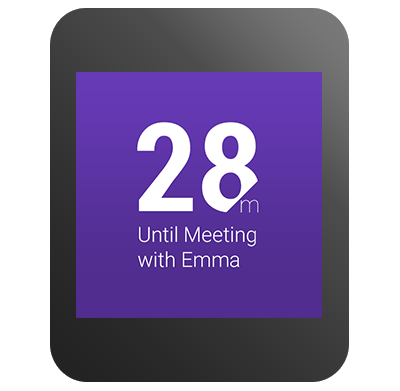

# 设计表盘

> 编写:[heray1990](https://github.com/heray1990) - 原文: <http://developer.android.com/training/wearables/watch-faces/designing.html>

类似于设计传统的表盘，创建 Android Wear 的表盘是一个清晰地显示时间的练习。Android Wear 设备为表盘提供了高级的功能，我们可以运用这些功能到我们的设计当中，例如鲜艳的色彩、动态的背景、动画和数据整合。然而，我们必须考虑到很多其它设计上的因素。

这节课总结了设计表盘需要考虑的因素和通用准则。更多关于这方面的内容，请见 [Watch Faces for Android Wear](http://developer.android.com/design/wear/watchfaces.html) 设计指引。

## 遵守设计准侧

当我们设计表盘的外观和表盘需要向用户表达哪些类型的信息的时候，请考虑一下这些设计准侧：

*为方形和圆形的设备作出规划*

我们的设计应该可以运行在方形和圆形的 Android Wear 设备上，包括那些[使用感知形状的 Layout](http://hukai.me/android-training-course-in-chinese/wearables/ui/layouts.html#same-layout) 的设备。

*支持所有的显示模式*

我们的表盘应该支持有限颜色的环境模式（ambient mode）和全彩色动画的交互模式（interactive mode）。

*优化特殊屏幕的技术*

在环境模式下，表盘应该让大部分像素保持黑色。根据屏幕技术，我们需要避免使用大块的白像素，仅仅使用黑色和白色，并禁用反锯齿。

*容纳系统 UI 组件*

我们的设计应该确保系统指示组件可见，当 notification cards 出现在屏幕上的时候用户还可以看到时间。

*整合数据*

我们的表盘可以利用配套手机设备上的传感器和蜂窝数据连接，来显示相关的上下文数据，例如天气或者用户的下一个日程表事件。

*提供设置选项*

我们可以让用户配置可穿戴应用或者 Android Wear 配套应用上某些设计特征（如颜色和尺寸）。

**Figure 1.** 表盘的例子.

更多关于 Android Wear 表盘的设计，请见 [Watch Faces for Android Wear](http://developer.android.com/design/wear/watchfaces.html) 设计指引。

## 创建实现策略

完成表盘的设计后，我们需要决定如何获得必要的数据和将表盘绘制到可穿戴设备上。大部分实现方案由如下部分组成：

* 一幅或多幅背景图片
* 接收需要数据的应用代码
* 绘制背景图片上的文本和形状的应用代码

我们一般在交互模式和环境模式使用两幅不同的背景图片。环境模式下的背景一般是全黑的。Android Wear 设备的屏幕密度（hdpi）应该是 320 x 320 像素，这样可以同时兼容方形和圆形设备。背景图片的四角在圆形设备上是不可见的。在我们的代码中，我们可以检测到设备屏幕的尺寸。如果设备的分辨率比图片的低，那么按比例缩小背景图片。为了提高性能，我们应该只对背景图片缩放一次并保存缩放后的 bitmap。

我们应该在需要时运行代码来检索上下文数据和保存结果，使得在每次绘制表盘的时候重用数据。例如，我们不需要每隔一分钟去刷新一次天气。

为了增加电池使用时间，在环境模式绘制表盘的应用代码应该相对简单。在环境模式下，我们通常用一组有限的颜色来绘制形状的轮廓。在交互模式下，我们可以使用全色彩、复杂的形状、渐变和动画来绘制表盘。

后面的课程将会介绍如何详细地实现表盘。